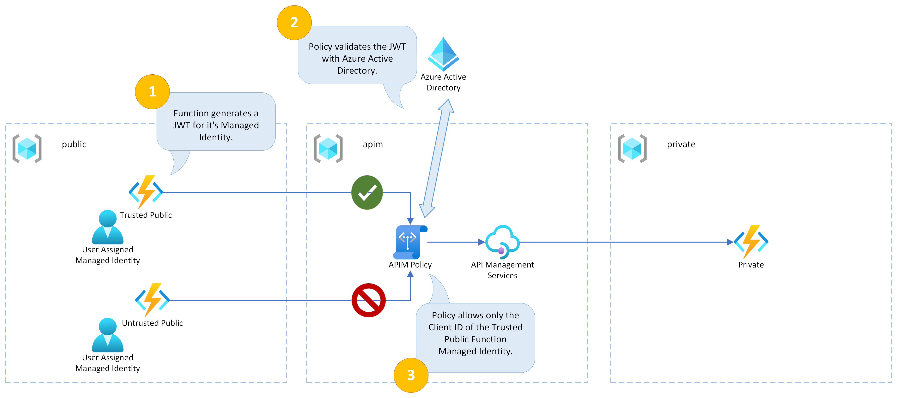
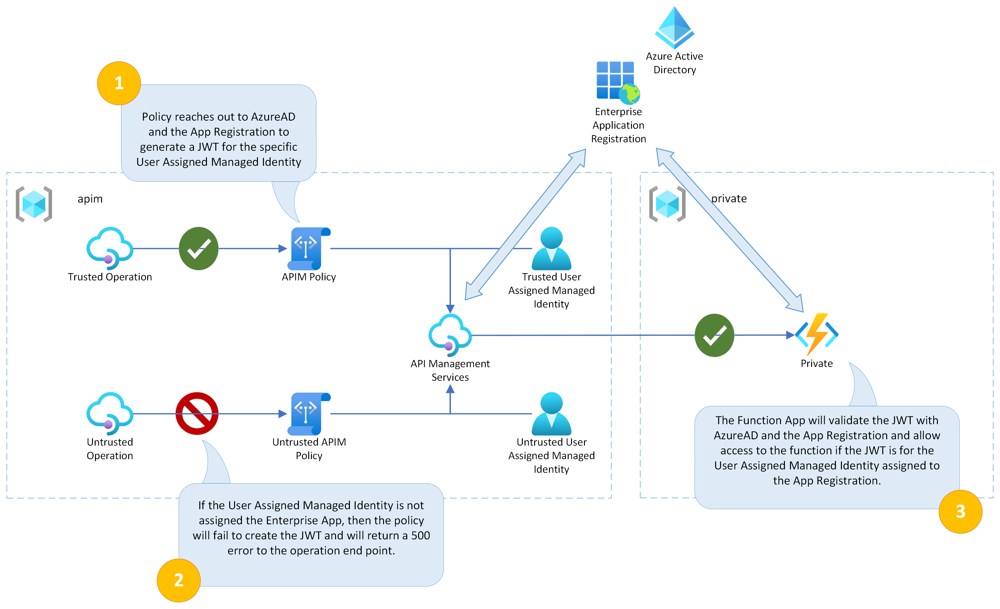

# Authenticating Azure Functions and Azure API Management with Managed Identity

This is example code showing how to authenticate from Azure Functions to Azure API Management (APIM) and from Azure API Management to Azure Functions using a managed identity.

## Content

| File/folder | Description |
|-------------|-------------|
| `src`       | Azure Function C# Code |
| `terraform` | Terraform IAC Code |
| `.gitignore` | Define what to ignore at commit time. |
| `CHANGELOG.md` | List of changes to the sample. |
| `CONTRIBUTING.md` | Guidelines for contributing to the sample. |
| `README.md` | This README file. |
| `LICENSE.md` | The license for the sample. |

## Features

This example covers the following use cases:

* Azure Function App to Azure API Management authentication using a Managed Identity.
* Azure API Management to Azure Function App authentication using a Managed Identity.

## Getting Started

### Prerequisites

- The Azure Functions Core Tools CLI: [Download](https://learn.microsoft.com/en-us/azure/azure-functions/functions-run-local?tabs=v4%2Cwindows%2Ccsharp%2Cportal%2Cbash#install-the-azure-functions-core-tools)
- HashiCorp Terraform CLI: [Download](https://www.terraform.io/downloads)
- Azure CLI: [Download](https://learn.microsoft.com/en-us/cli/azure/install-azure-cli-windows?tabs=azure-cli#install-or-update)
- An Azure Subscription: [Free Account](https://azure.microsoft.com/en-gb/free/search/)

### Installation

- Clone this repository to your local machine

### Quickstart

We deploy the infrastructure using Terraform first. Follow these steps to login to Azure and apply the Terraform.

1. Open your console of choice and navigate to the the `/terraform` folder.
1. Run `az login` to login to your Azure Account.
1. Run `az account set --subscription [my-subscription]` where [my-subscription] is the name of your subscription.
1. Run `terraform init` to pull down the providers.
1. Run `terraform apply`. Take a look at the plan it generates and then type `yes` to run the plan.
1. Take note of the outputs from Terraform as you'll need these later.
1. Take a look at the resource groups and resources in the Azure portal.

Once you are happy with the deployed resources, we need to deploy the function code. Terraform will output a script in the `deploy_script` output to help with this, or you can follow these steps.

1. Navigate to the `/src/Functions/PrivateFunction` folder.
1. Deploy the private function by running `func azure functionapp publish [private-function-name] --csharp` where [private-function-name] is the name of your private function. This will have been outputted from terraform as `private_function_name`.
1. Navigate to the `/src/Functions/PublicFunction` folder.
1. Deploy the untrusted public function by running `func azure functionapp publish [public-untrusted-function-name] --csharp` where [public-untrusted-function-name] is the name of your untrusted public function. This will have been outputted from terraform as `public_untrusted_function_name`.
1. Deploy the trusted public function by running `func azure functionapp publish [public-trusted-function-name] --csharp` where [public-trusted-function-name] is the name of your trusted public function. This will have been outputted from terraform as `public_trusted_function_name`.

## Demos

Each use case has it's own demo as follows:

### Azure Function to APIM Authentication

This following diagram provides an overview of the demo for this use case:

For the Function App to APIM authentication use case, the most important parts can be found in these files:

* APIM Policy definition: [apim.tf](terraform/apim.tf)
* Azure Function C# code: [Test.cs](src/Functions/PublicFunction/Test.cs)

The Azure Function code follows these steps:

1. Get the user assigned managed identity.
1. Generate a JWT from the user assigned managed identity.
1. Make a call to the APIM end point, passing the JWT in the Authorization Bearer header.

The APIM Policy has the following attributes:

* It uses the `validate-azure-ad-token` policy type.
* It specifies that only the client ID of the user assigned managed identity for the trusted public function app can access the operation. It does this by including it in the `client-application-ids` list.

To run the demo, follow these steps:

1. Navigate to the untrusted function app, using the url in `public_untrusted_demo_url`. You should see a 401 error like this: `{ "statusCode": 401, "message": "Invalid Azure AD JWT" }`.
2. Navigate to the trusted function app, using the url in `public_trusted_demo_url`.You should see a successful call like this: `{"message":"Hello from the Private Function!","dateOfMessage":"2022-11-08T12:14:59.4735675+00:00"}`.

As you can see the untrusted function does not have it's managed identity specified in the APIM policy, so it is not authenticated. More details on the policy can be found [here](https://learn.microsoft.com/en-us/azure/api-management/api-management-access-restriction-policies#ValidateAAD).

### Azure API Management to Azure Function

This following diagram provides an overview of the demo for this use case:

For the APIM to Function App authentication use case, the most important parts can be found in these files:

* APIM Policy definition: [apim.tf](terraform/apim.tf)
* Azure Function Authentication Configuration: [function_private.tf](terraform/function_private.tf)
* AzureAD App Registration: [azuread_applications.tf](terraform/azuread_applications.tf)

The APIM Policy includes the following steps:

1. It uses the `authentication-managed-identity` policy to retrieve the JWT to authenticate. It specified the client ID of the App Registration in the `resource` attribute and the client ID of the user assigned managed identity in the `client-id` attribute.
2. It takes the output of the previous step and adds the JWT to the Authorization Bearer header using the `set-header` policy.

The AzureAD App Registration has the following attributes:

* It is configured using the instructions defined here in the [documentation](https://learn.microsoft.com/en-us/azure/app-service/configure-authentication-provider-aad).
* It is configured to require users or groups to be assigned using the `app_role_assignment_required` property.
* It has the user assigned managed identity assigned to the default role.
* This combination of settings ensures that only the user assigned managed identity we specified has access to the Private Function.

The Private Function has the following attributes:

* It is configured to have AzureAD authentication enabled using the App Registration described in the previous section
* The enforces that only authenticated users / services can access the Function App.

To run the demo, follow these steps:

1. Navigate to the trusted function app, using the url in `public_trusted_demo_url`.You should see a successful call like this: `{"message":"Hello from the Private Function!","dateOfMessage":"2022-11-08T12:14:59.4735675+00:00"}`.
2. Open Azure Portal and navigate to your APIM instance.
3. Open the `APIs` section and click on the `Untrusted API` entry.
4. Select the `Test Operation` and open the `Test` tab.
5. Hit `Send` and you will get a 500 error.
6. Hit `Trace`, then navigate to the Trace and scroll down to the `authentication-managed-identity` section.
7. You will see details of why a 500 error was produced and it is because the user assigned managed identity is not assigned to the App Registration.

## Resources

- [Validate AAD APIM Policy](https://learn.microsoft.com/en-us/azure/api-management/api-management-access-restriction-policies#ValidateAAD)
- [Authenticate with Managed Identity APIM Policy](https://learn.microsoft.com/en-us/azure/api-management/api-management-authentication-policies#ManagedIdentity)
- [Managed Identity for Linux Function App Storage has limited support](https://learn.microsoft.com/en-us/azure/azure-functions/functions-reference?tabs=blob#connecting-to-host-storage-with-an-identity-preview)
- [Azure Functions Core Tools reference](https://learn.microsoft.com/en-us/azure/azure-functions/functions-core-tools-reference?tabs=v2#func-azure-functionapp-fetch-app-settings)
- [Azure Functions AAD Authentication](https://learn.microsoft.com/en-us/azure/app-service/configure-authentication-provider-aad)