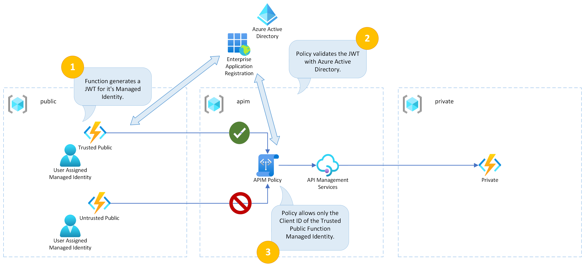

# Authenticating Azure Functions and Azure API Management with Managed Identity

This is example code showing how to authenticate from Azure Functions to Azure API Management (APIM) and from Azure API Management to Azure Functions using a managed identity.

## Content

| File/folder | Description |
|-------------|-------------|
| `src`       | Azure Function C# Code |
| `terraform` | Terraform IAC Code |
| `.gitignore` | Define what to ignore at commit time. |
| `CHANGELOG.md` | List of changes to the sample. |
| `CONTRIBUTING.md` | Guidelines for contributing to the sample. |
| `README.md` | This README file. |
| `LICENSE.md` | The license for the sample. |

## Features

This example covers the following use cases:

* Azure Function App to Azure API Management authentication using a Managed Identity.
* Azure API Management to Azure Function App authentication using a Managed Identity.

## Important Notes

There are currently some limitations when using Managed Identity for these use cases that you should be aware of:

1. Access Tokens are cached for 24 hours and there is no way to override this. This means that any changes you make to your App Registration with regards to app roles, claims, etc will not be available in the token generated from the MSI enabled app for up to 24 hours. This can be quite problematic when developing, but should not have a significant impact on production workloads. More details on this limitation can be found [here](https://learn.microsoft.com/en-us/azure/active-directory/managed-identities-azure-resources/managed-identities-faq#are-managed-identities-tokens-cached) and [here](https://learn.microsoft.com/en-us/azure/active-directory/managed-identities-azure-resources/managed-identity-best-practice-recommendations#limitation-of-using-managed-identities-for-authorization). HINT: When developing with Terraform, you can just delete your Managed Identity and let Terraform re-create it to refresh your token.

2. Managed Identities (any Service Principal) cannot be assigned to an App Registration App Role via an AzureAD Group. This is a major limitation for customers that want to use groups across the board, but it does not mean you can't use Managed Identities. It simply means you have assign the Managed Identity directly the the App Registration App Role. More details on this limitation can be found [here](https://learn.microsoft.com/en-us/azure/active-directory/develop/howto-add-app-roles-in-azure-ad-apps#declare-roles-for-an-application). Specifically the sentence `Currently, if you add a service principal to a group, and then assign an app role to that group, Azure AD doesn't add the roles claim to tokens it issues.`.

## Getting Started

### Prerequisites

- The Azure Functions Core Tools CLI: [Download](https://learn.microsoft.com/en-us/azure/azure-functions/functions-run-local?tabs=v4%2Cwindows%2Ccsharp%2Cportal%2Cbash#install-the-azure-functions-core-tools)
- HashiCorp Terraform CLI: [Download](https://www.terraform.io/downloads)
- Azure CLI: [Download](https://learn.microsoft.com/en-us/cli/azure/install-azure-cli-windows?tabs=azure-cli#install-or-update)
- An Azure Subscription: [Free Account](https://azure.microsoft.com/en-gb/free/search/)

### Installation

- Clone this repository to your local machine

### Quickstart

We deploy the infrastructure using Terraform first. Follow these steps to login to Azure and apply the Terraform.

1. Open your console of choice and navigate to the the `/terraform` folder.
1. Run `az login` to login to your Azure Account.
1. Run `az account set --subscription [my-subscription]` where [my-subscription] is the name of your subscription.
1. Run `terraform init` to pull down the providers.
1. Run `terraform apply`. Take a look at the plan it generates and then type `yes` to run the plan.
1. The function code is deployed as part of the Terraform using a local provisioner which runs the `func azure functionapp publish` command of the Azure Functions Core Tools CLI.
1. Take note of the outputs from Terraform as you'll need these later.
1. Take a look at the resource groups and resources in the Azure portal.

## Demos

Each use case has it's own demo as follows:

### Azure Function to APIM Authentication

This following diagram provides an overview of the demo for this use case:

For the Function App to APIM authentication use case, the most important parts can be found in these files:

* APIM Policy definition: [apim.tf](terraform/apim.tf)
* Azure Function C# code: [Test.cs](src/Functions/PublicFunction/Test.cs)

The Azure Function code follows these steps:

1. Get the user assigned managed identity.
1. Generate a JWT from the user assigned managed identity, passing in the App Registration scope in the case of the `group` example.
1. Make a call to the APIM end point, passing the JWT in the Authorization Bearer header.

There are two different examples of the APIM Policy:

The `simple` function does not use an App Registration and generates a generic JWT for itself:

* It uses the `validate-azure-ad-token` policy type.
* It specifies that only the client ID of the user assigned managed identity for the trusted public function app can access the operation. It does this by including it in the `client-application-ids` list.

The `group` function uses an App Registration so it can be assigned an App Role and pass that claim to APIM:

* It uses the `validate-jwt` policy type.
* It specifies that only the App Registration audience is valid. It does this by including it in the `audiences` list.
* It specifies that only the App Role claim assigned to the Managed Identity is valid. It does this by including it in the `required-claims` list.

To run the demo, follow these steps:

1. Simple Untrusted: Navigate to the untrusted function app, using the url in `public_untrusted_simple_demo_url`. You should see a 401 error like this: `{ "statusCode": 401, "message": "Invalid Azure AD JWT" }`.
1. Simple Trusted: Navigate to the trusted function app, using the url in `public_trusted_simple_demo_url`. You should see a successful call like this: `{"message":"Hello from the Private Function! The APIM Managed Identity has been assigned to the role: Private.Example","dateOfMessage":"2022-11-08T12:14:59.4735675+00:00"}`.
1. Group Untrusted: Navigate to the untrusted function app, using the url in `public_untrusted_group_demo_url`. You should see a 401 error like this: `{ "statusCode": 401, "message": "Unauthorized. Access token is missing or invalid." }`.
1. Group Trusted: Navigate to the trusted function app, using the url in `public_trusted_group_demo_url`. You should see a successful call like this: `{"message":"Hello from the Private Function! The APIM Managed Identity has been assigned to the role: Private.Example","dateOfMessage":"2022-11-08T12:14:59.4735675+00:00"}
 
As you can see the untrusted function does not have it's managed identity specified in the APIM policy, so it is not authenticated. More details on the policy can be found [here](https://learn.microsoft.com/en-us/azure/api-management/api-management-access-restriction-policies#ValidateAAD).

### Azure API Management to Azure Function

This following diagram provides an overview of the demo for this use case:

For the APIM to Function App authentication use case, the most important parts can be found in these files:

* APIM Policy definition: [apim.tf](terraform/apim.tf)
* Azure Function Authentication Configuration: [function_private.tf](terraform/function_private.tf)
* AzureAD App Registration: [azuread_applications.tf](terraform/azuread_applications.tf)

The APIM Policy includes the following steps:

1. It uses the `authentication-managed-identity` policy to retrieve the JWT to authenticate. It specified the client ID of the App Registration in the `resource` attribute and the client ID of the user assigned managed identity in the `client-id` attribute.
2. It takes the output of the previous step and adds the JWT to the Authorization Bearer header using the `set-header` policy.

The AzureAD App Registration has the following attributes:

* It is configured using the instructions defined here in the [documentation](https://learn.microsoft.com/en-us/azure/app-service/configure-authentication-provider-aad).
* It is configured to require users or groups to be assigned using the `app_role_assignment_required` property.
* It has the user assigned managed identity assigned to the default role.
* This combination of settings ensures that only the user assigned managed identity we specified has access to the Private Function.

The Private Function has the following attributes:

* It is configured to have AzureAD authentication enabled using the App Registration described in the previous section
* The enforces that only authenticated users / services can access the Function App.

To run the demo, follow these steps:

1. Navigate to the trusted function app, using the url in `public_trusted_demo_url`.You should see a successful call like this: `{"message":"Hello from the Private Function! The APIM Managed Identity has been assigned to the role: Private.Example","dateOfMessage":"2022-11-08T12:14:59.4735675+00:00"}`.
2. Open Azure Portal and navigate to your APIM instance.
3. Open the `APIs` section and click on the `Untrusted API` entry.
4. Select the `Test Operation` and open the `Test` tab.
5. Hit `Send` and you will get a 500 error.
6. Hit `Trace`, then navigate to the Trace and scroll down to the `authentication-managed-identity` section.
7. You will see details of why a 500 error was produced and it is because the user assigned managed identity is not assigned to the App Registration.

## Resources

- [Validate AAD APIM Policy](https://learn.microsoft.com/en-us/azure/api-management/api-management-access-restriction-policies#ValidateAAD)
- [Authenticate with Managed Identity APIM Policy](https://learn.microsoft.com/en-us/azure/api-management/api-management-authentication-policies#ManagedIdentity)
- [Managed Identity for Linux Function App Storage has limited support](https://learn.microsoft.com/en-us/azure/azure-functions/functions-reference?tabs=blob#connecting-to-host-storage-with-an-identity-preview)
- [Azure Functions Core Tools reference](https://learn.microsoft.com/en-us/azure/azure-functions/functions-core-tools-reference?tabs=v2#func-azure-functionapp-fetch-app-settings)
- [Azure Functions AAD Authentication](https://learn.microsoft.com/en-us/azure/app-service/configure-authentication-provider-aad)
